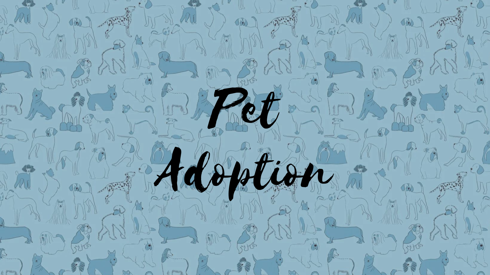
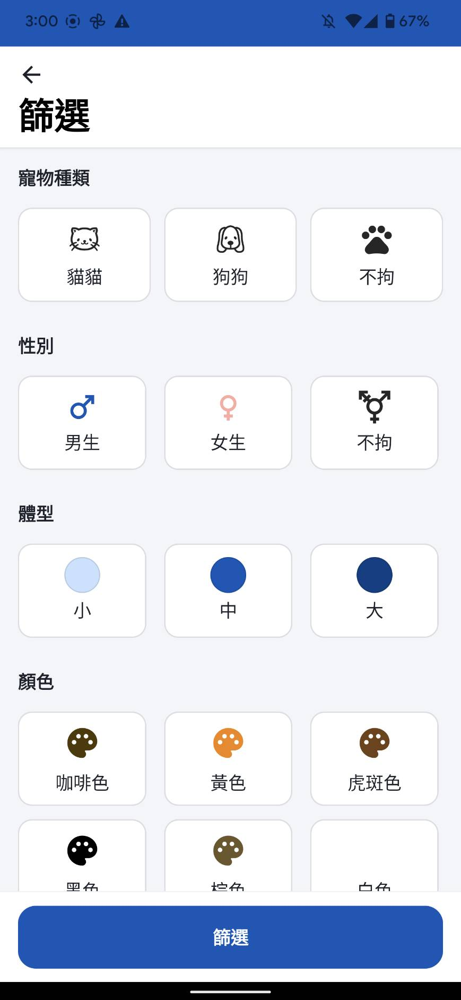
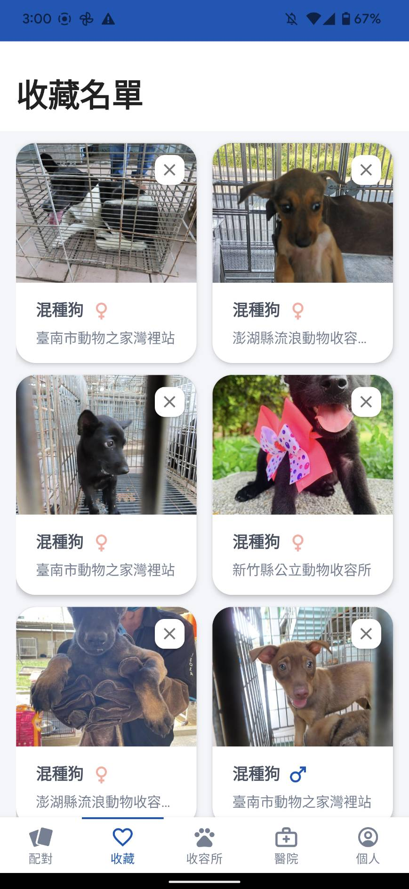
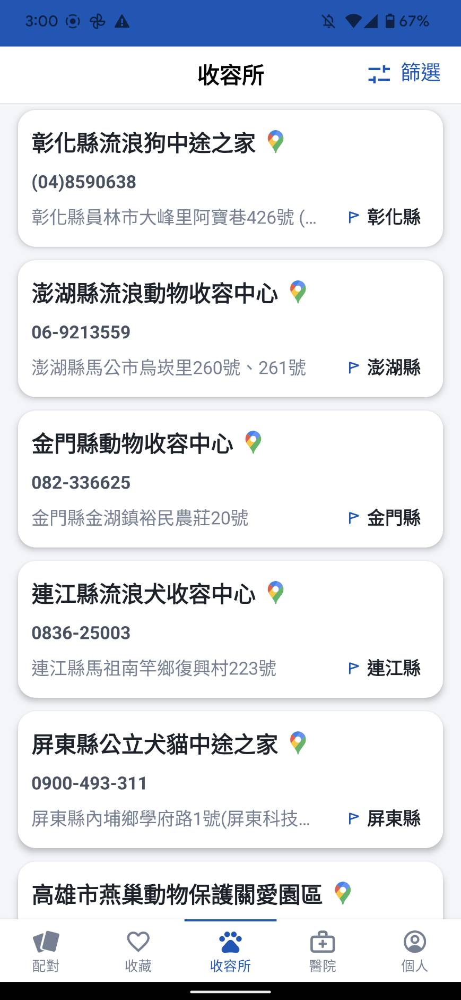
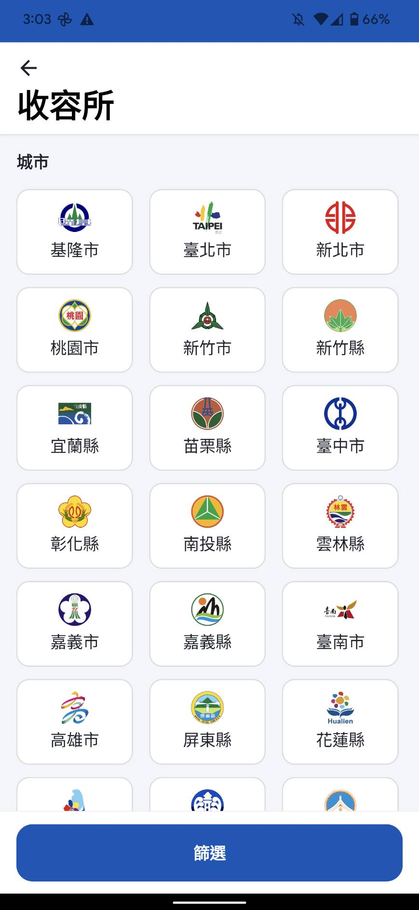
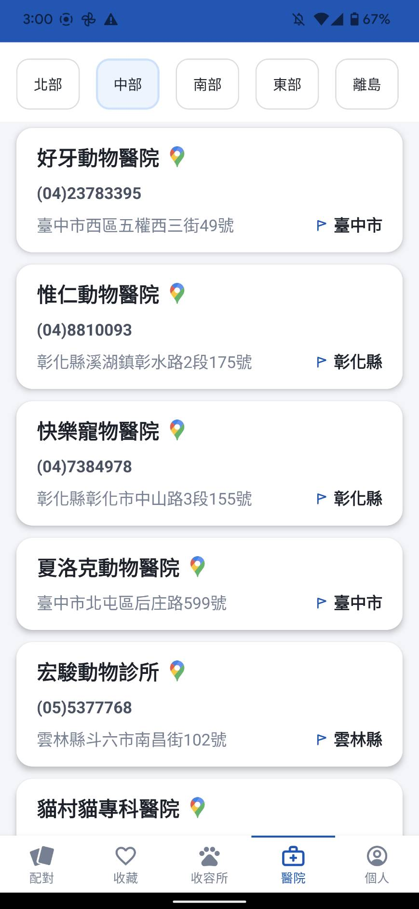

#  PetAdoption 
 
 

This application is a matching platform for pet adoption. 

By interfacing pet adoption open data provided by government, users can learn about pet adoption information through this platform, reducing the time and cost of going to the shelter. 

It also provides map information of shelters and pet hospitals, so that users can go to the shelter for adoption after finding their favorite pet.

## Features
### :paw_prints: Look for pets

Rendering a list of pets using Paging, user can choose to swipe or favorite the pet.

Click the item can view detailed information, including gender, coat color, shelter map, etc.

And you can also click the "Take Me Home" button to guide the National Animal Shelter System to make an appointment for on-site evaluation and adoption.

### :paw_prints: Filter

Provides a variety of filtering options to make it easier to find your favorite pet.

### :paw_prints: Favorite

Using Room to store a user's favorite pets, where you can view the list of favorites and choose the one you like the most.

### :paw_prints: Shelter and Hospital

Use Paging to present a list of shelters and hospitals, and provide a variety of filtering methods.

  

### :paw_prints: Map

Click the item of shelter or hospital list to view the map information, including the address and the weather and temperature of the place, etc.

At the same time, you can click the marker to view the route information.

Also it provides the function of "searching nearby areas", you can see where there are shelters in the nearby areas.

## Implementation
* Architecture
  * MVVM with clean architecture
  * multi module(app、domain、data)
* Design Pattern
  * Singleton
  * Dependency Injection
  * Adapter
  * Facade
  * Command
  * Observer
* Android Jetpack
  * View Binding
  * Lifecycle
  * LiveData
  * ViewModel
  * Paging
  * Room
* DI
  * Hilt
* User Interface
  * RecyclerView
  * CoordinatorLayout
  * CollapsingToolbarLayout
* Internet
  * [Retrofit2](https://github.com/square/retrofit)
  * [OkHttp](https://github.com/square/okhttp)
* Tools
  * Firebase `Authentication` `Crashlytics`
  * Google Cloud Platform API `Map API` `Place API` `Direction API`
* Third Party Libraries
  * [Timber](https://github.com/JakeWharton/timber)
  * [Retrofit](https://github.com/square/retrofit)
  * [RxBinding](https://github.com/JakeWharton/RxBinding)
  * [stetho](https://github.com/facebook/stetho)
  * [Glide](https://github.com/bumptech/glide)

## Data
open data provided by government
 * [PetAdoption](https://data.gov.tw/dataset/85903?fbclid=IwAR132RQqrjrwjHYPq8lrm3uguDuFgqmAa5EBUlvojBvlAPOM068v3YZJVWs)
 * [Weather](https://opendata.cwb.gov.tw/index)
 * [Shelter](https://data.gov.tw/dataset/134284)
 * [Veterinary](https://data.coa.gov.tw/OpenData/Query/AdvSearch.aspx?id=078)

## Requirements
* Android SDK 21

## Contact
Roger Chang - rogerchang7904@gmail.com

